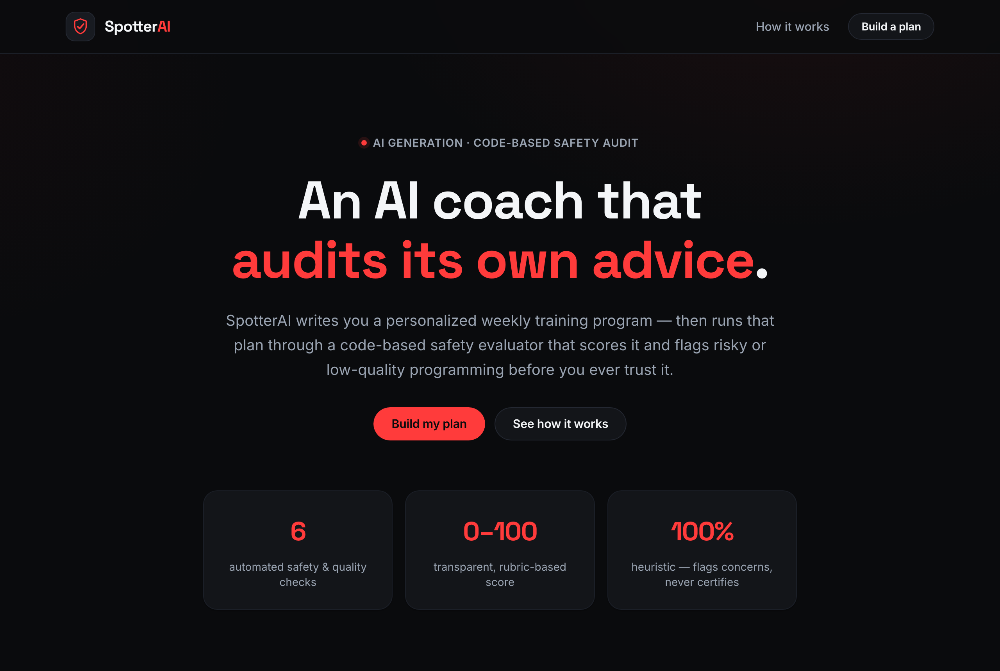
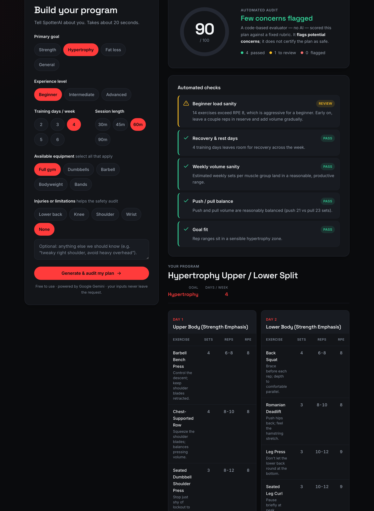
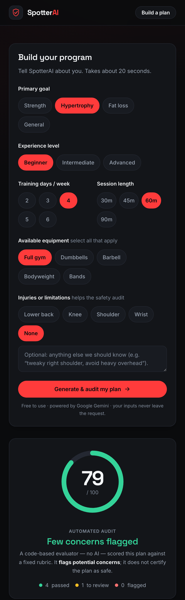
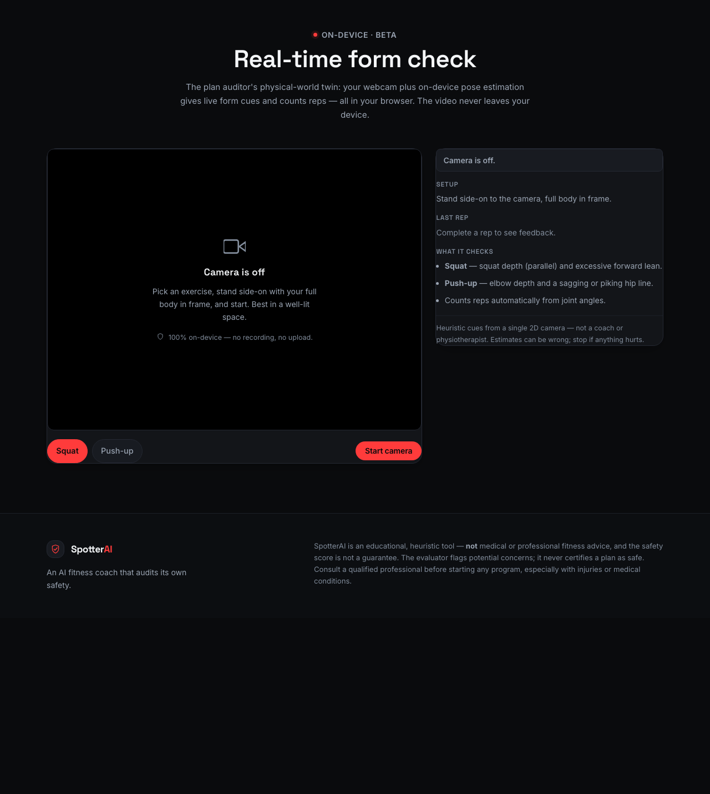
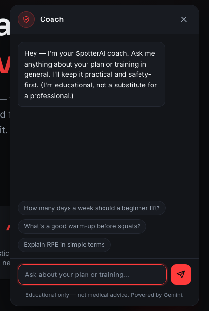

# SpotterAI 🟢

**An AI fitness coach that audits its own safety.**

I built an AI workout coach — and then built a separate, code-based system that
audits the AI's plans for unsafe or low-quality advice. SpotterAI generates a
personalized weekly training program with a large language model, then runs that
generated plan through a pure-code **safety & quality evaluator** that scores it
0–100 and flags risky programming (no rest days, lopsided volume, injury
contraindications, beginner overload, and more) *before* you trust it. The
interesting engineering isn't the model writing a workout — anyone can prompt for
that. It's the second system that checks the first one's work, which is exactly
the kind of evaluation and AI-safety thinking that matters when you ship LLM
features to real users.

SpotterAI then goes a step further with two features built on the same
transparent, safety-first philosophy: a **real-time form check** that uses
on-device pose estimation to count reps and flag form issues live through your
webcam (the video never leaves your device), and a **plan-aware coach chatbot**
that answers questions about your program and training in general.

---

## Screenshots

| Landing / hero | Safety score, checks & plan | Mobile |
| --- | --- | --- |
|  |  |  |

| Real-time form check | Coach chatbot |
| --- | --- |
|  |  |

> _Captured from the running app. Re-shoot anytime and overwrite the files in `docs/`._

---

## How it works

```
 ┌────────────┐   inputs    ┌──────────────────────┐   strict JSON   ┌──────────────┐
 │  Browser   │ ──────────▶ │  /api/generate       │ ──────────────▶ │   Gemini     │
 │  (form)    │             │  (serverless, holds  │                 │  Flash (free)│
 │            │ ◀────────── │   the API key)       │ ◀────────────── │              │
 └─────┬──────┘   plan JSON └──────────────────────┘                 └──────────────┘
       │
       │  same plan
       ▼
 ┌────────────────────┐
 │  evaluator.js      │   pure code, no LLM
 │  → score + checks  │   estimates volume, balance, recovery, injury risk
 └────────────────────┘
       │
       ▼
   Animated safety score + per-check explanations + the day-by-day program
```

1. **You describe your training** — goal, experience, days/week, equipment,
   session length, and any injuries — through a fully custom, accessible form.
2. **A serverless function drafts the program.** `/api/generate` holds the Gemini
   API key (never the browser), prompts the model for a **strict JSON** weekly
   plan, validates the shape, strips stray code fences, and retries up to twice on
   malformed output.
3. **Code audits the plan.** [`evaluator.js`](evaluator.js) — no LLM involved —
   estimates weekly sets per muscle group, checks push/pull balance and recovery,
   maps stated injuries to risky movements, and produces a transparent 0–100 score
   with a plain-language reason for every flag.
4. **Reliability fallback.** If the API is unavailable or rate-limited (HTTP 429),
   the app gracefully shows a saved example plan with a small notice — and the
   evaluator still runs on it, so the demo always works at $0.

---

## Evaluation methodology

The evaluator is the centerpiece. It is **deterministic, code-based, and
transparent** — every threshold lives in a named constant in
[`evaluator.js`](evaluator.js) (`THRESHOLDS` and `PENALTY`) so the rubric is easy
to read and tune. It **flags potential concerns; it never certifies a plan as
safe.**

### The checks

| # | Check | What it does | Flags when… |
|---|-------|--------------|-------------|
| 1 | **Recovery & rest days** | Counts training days in the week | `warn` at 6 training days (one rest day); `fail` at 7 (no rest at all) |
| 2 | **Weekly volume sanity** | Estimates weekly working sets per muscle group via exercise-name keyword matching | `warn` above ~24 sets/muscle or when a prime mover is under-stimulated for a muscle-building goal; `fail` above ~32 sets/muscle |
| 3 | **Push / pull balance** | Compares upper-body pushing vs pulling volume | `warn` when one side is >2× the other; `fail` when >3× or one side is entirely absent (e.g. all push, no pull) |
| 4 | **Injury contraindications** | Maps each stated injury to risky movement keywords and suggests regressions | `warn` on one contraindicated movement, `fail` on two or more — e.g. lower back → heavy axial loading, shoulder → heavy overhead, knee → deep loaded knee flexion, wrist → straight-bar pressing |
| 5 | **Beginner load sanity** | Checks intensity/volume against the beginner level | `warn` when multiple exercises exceed RPE 8 or volume is high; `fail` when RPE 10 (max effort) is prescribed to a beginner |
| 6 | **Goal fit** | Checks average rep ranges and structure against the goal | `warn` when rep ranges don't match the stated goal (e.g. very high reps for a strength goal) |

> Injuries generate **one check row per injury** so each gets its own explanation
> and regression suggestion.

### The scoring rubric

The score starts at **100** and **deducts points per `warn`/`fail`, weighted by
severity** (see the `PENALTY` constant). More safety-critical checks deduct more:

| Check | `warn` | `fail` |
|-------|:------:|:------:|
| Injury contraindications | −12 | −24 |
| Push / pull balance | −10 | −18 |
| Beginner load sanity | −10 | −18 |
| Weekly volume sanity | −9 | −16 |
| Recovery & rest days | −8 | −16 |
| Goal fit | −6 | −12 |

The final score is clamped to `[0, 100]` and mapped to a color-coded band in the
UI — but the **individual checks, not the single number, are the point**: each row
explains *why* it flagged so the user can make an informed decision.

> **Heuristics, not medical rules.** The muscle mapping and injury rules are
> intentionally simple keyword heuristics. They will occasionally over- or
> under-flag. That's an honest reflection of what a lightweight automated auditor
> can and can't do — which is itself part of the lesson.

---

## Beyond the plan: form check + coach chat

Two further features extend the same idea — transparent, safety-first coaching —
past the written program.

### 🎥 Real-time form check (100% on-device)

A webcam-based form auditor — the physical-world twin of the plan evaluator.
[`form-coach.js`](form-coach.js) runs **MediaPipe Pose** entirely in the browser
to track 33 body landmarks, and [`form-evaluator.js`](form-evaluator.js) — pure
code, the same style as `evaluator.js` — turns those landmarks into **joint
angles**, applies rule-based heuristics, **counts reps automatically**, and shows
**live form cues**:

- **Squat** — flags shallow depth (above parallel) and excessive forward lean.
- **Push-up** — flags incomplete elbow depth and a sagging or piking hip line.
- All thresholds live in the `FORM_THRESHOLDS` constant, mirroring the
  evaluator's tunable-rubric style; reps are tracked by a small joint-angle state
  machine (`RepCounter`).

It is **100% on-device**: the pose model is lazy-loaded from a free CDN only when
you start the camera, and **the video never leaves your browser** — no upload, no
recording, no server call. Honest framing, as everywhere else: these are
*heuristic cues from a single 2D camera, not a coach or physiotherapist.*

### 💬 Coach chatbot

A floating assistant ([`chat.js`](chat.js) + [`api/chat.js`](api/chat.js)) answers
questions about your plan and general training. It is **plan-aware** — your
generated program is attached as context, so it can explain *your* rep ranges or
suggest a swap — and **safety-first by system prompt**: it defers to professionals
for anything clinical and never diagnoses or prescribes. It reuses the same
hardened Gemini client and the 429 / timeout fallbacks as the generator.

---

## Tech stack

- **Frontend:** plain HTML + CSS + vanilla JavaScript (ES modules). No framework,
  **no build step** — it deploys as static files.
- **Design:** a hand-built design-token system (color, spacing, radius, shadow,
  type scale) in CSS variables; [Space Grotesk + Inter](https://fonts.google.com)
  via Google Fonts; an animated, pure-SVG safety-score ring. No UI kit, no paid
  assets.
- **Backend:** two Node.js serverless functions — `api/generate.js` (plan
  generation) and `api/chat.js` (coach chatbot) — that proxy Google **Gemini**
  (free Flash model) and hold the API key. They share one hardened Gemini client
  (`lib/gemini.js`) with the model name in a single place. Native `fetch`,
  **zero dependencies**.
- **On-device computer vision:** **MediaPipe Tasks Vision** (pose estimation),
  loaded from a free CDN and run entirely in the browser for the real-time form
  check — no server, no key, nothing uploaded.
- **Hosting:** Vercel free tier (also runs on Netlify free tier).
- **No database, no auth, no payments.** All state is client-side.

**Total cost to build, host, and run: $0.**

---

## Project structure

```
spotterai/
├─ index.html             # markup + semantic structure
├─ style.css              # design tokens + all components
├─ app.js                 # controller: form → API → evaluator → render
├─ evaluator.js           # ⭐ pure-code safety & quality auditor (the plan)
├─ form-evaluator.js      # ⭐ pure-code form auditor (joint angles → cues, reps)
├─ form-coach.js          # webcam + MediaPipe Pose + skeleton overlay
├─ chat.js                # floating coach chatbot (UI)
├─ store.js               # tiny shared state (latest plan → chatbot context)
├─ api/
│  ├─ generate.js         # serverless Gemini proxy — plan generation (holds key)
│  └─ chat.js             # serverless Gemini proxy — coach chatbot
├─ lib/
│  └─ gemini.js           # shared, hardened Gemini client (model name lives here)
├─ data/
│  └─ sample-plans.json   # offline fallback plans (429 / offline demo)
├─ docs/                  # screenshots
├─ .env.example           # GEMINI_API_KEY=...
├─ .gitignore             # ignores .env and node_modules
├─ vercel.json            # function config
└─ README.md
```

---

## Free setup & deploy (step by step)

Everything below is free and requires **no credit card**.

### 1. Get a free Gemini API key

1. Go to **[Google AI Studio → API keys](https://aistudio.google.com/app/apikey)**.
2. Sign in with a Google account and click **Create API key**. No billing, no card.
3. Copy the key.

### 2. Run it locally

```bash
# clone your repo, then:
cp .env.example .env          # create your local env file
# open .env and paste your key:  GEMINI_API_KEY=your_key_here

# run with the Vercel dev server (serves the static site AND the function)
npx vercel dev
# → open the printed local URL (e.g. http://localhost:3000)
```

> `npx vercel dev` is the easiest way to run the serverless function locally. If
> you just open `index.html` directly without a server, the live API call won't be
> available — but SpotterAI will automatically fall back to a saved example plan
> and the evaluator still runs, so you can demo the audit immediately.

### 3. Push to GitHub

```bash
git init
git add .
git commit -m "SpotterAI: AI workout coach with a code-based safety audit"
git branch -M main
git remote add origin https://github.com/<you>/spotterai.git
git push -u origin main
```

### 4. Deploy free on Vercel

1. Go to **[vercel.com](https://vercel.com)** and sign in with GitHub (free Hobby
   plan).
2. **Add New → Project** and import your `spotterai` repo. No build settings to
   change — it's a static site with a serverless function.
3. Open **Project → Settings → Environment Variables** and add:
   - **Name:** `GEMINI_API_KEY`  **Value:** *your key from step 1*
4. Click **Deploy**. Your live URL is ready in seconds.

> Netlify works too: it auto-detects the `api/` function, and you add the same
> `GEMINI_API_KEY` under **Site settings → Environment variables**.

---

## Configuration

- **Model:** the Gemini model name is a single constant — `GEMINI_MODEL` at the
  top of [`lib/gemini.js`](lib/gemini.js), shared by both serverless functions.
  Free Flash models change over time; update it in that one place.
- **Plan rubric:** all evaluator thresholds and penalties are in the `THRESHOLDS`
  and `PENALTY` constants at the top of [`evaluator.js`](evaluator.js).
- **Form rubric:** all form-check angle thresholds are in the `FORM_THRESHOLDS`
  constant in [`form-evaluator.js`](form-evaluator.js).

---

## Limitations & responsible use

- **This is an educational, heuristic tool — not medical or professional fitness
  advice.** The safety score is a heuristic, not a guarantee.
- **The evaluator flags concerns; it never certifies a plan as "safe."** A high
  score means *few automated checks fired*, not that a plan is appropriate for
  *you*.
- **The checks are deliberately simple.** Muscle-group and injury detection use
  keyword matching on exercise names, so they can misclassify unusual movements,
  and they can't see your medical history, technique, or recovery capacity.
- **Always consult a qualified coach or clinician** before starting a program,
  especially with injuries or medical conditions.
- **AI output is imperfect.** Generated plans can contain mistakes the evaluator
  doesn't catch — which is precisely why the audit layer exists, and why it's
  framed as a second opinion rather than the final word.
- **The form check is experimental.** It infers movement from a single 2D webcam,
  so rep counts and cues can be wrong, and it can't judge load, tempo, or true 3D
  joint positions. Treat it as a rough mirror, not a judge — and stop if anything
  hurts. It runs entirely on-device and uploads/stores nothing.
- **The chatbot is educational.** It can be wrong or out of date and is not a
  substitute for a qualified coach, dietitian, or clinician.

---

## Why I built it

This project is a compact demonstration of **LLM evaluation** and **AI-safety
thinking**: take a generative model's output and subject it to an independent,
rule-based audit with a transparent rubric, graceful failure modes, and honest
framing about what the automated checks can and can't guarantee — wrapped in a
clean, production-quality interface.

## License

MIT — free to use, learn from, and build on.
