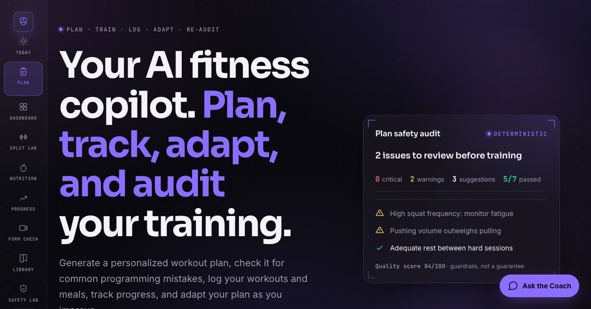
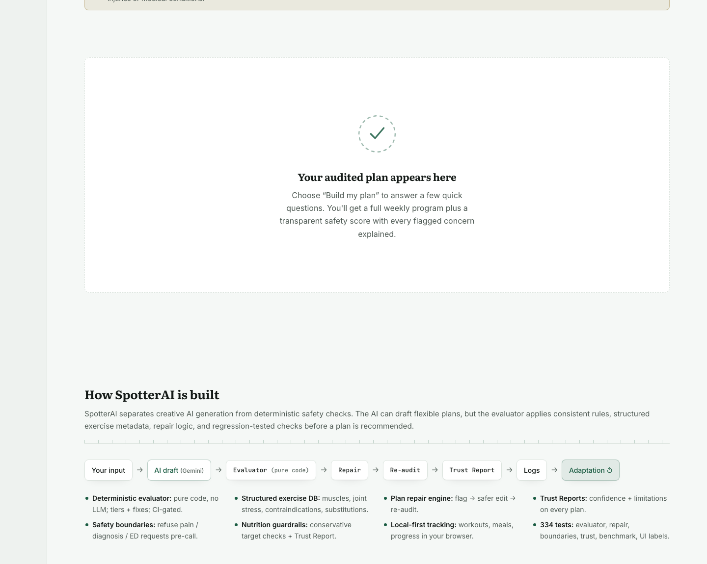
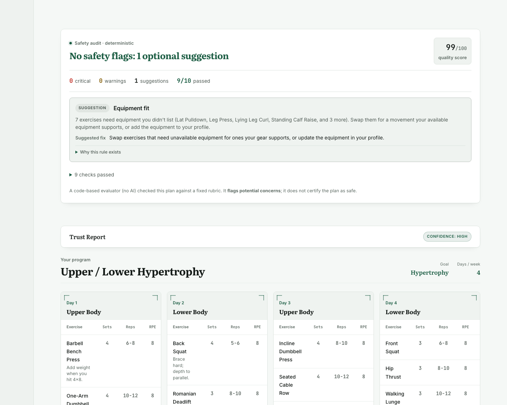
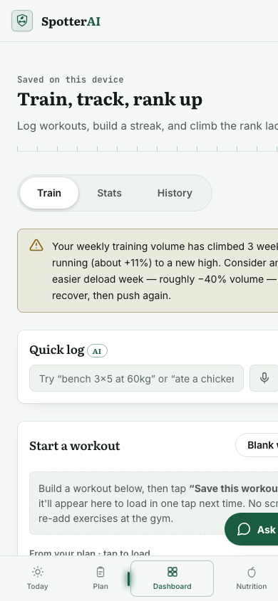
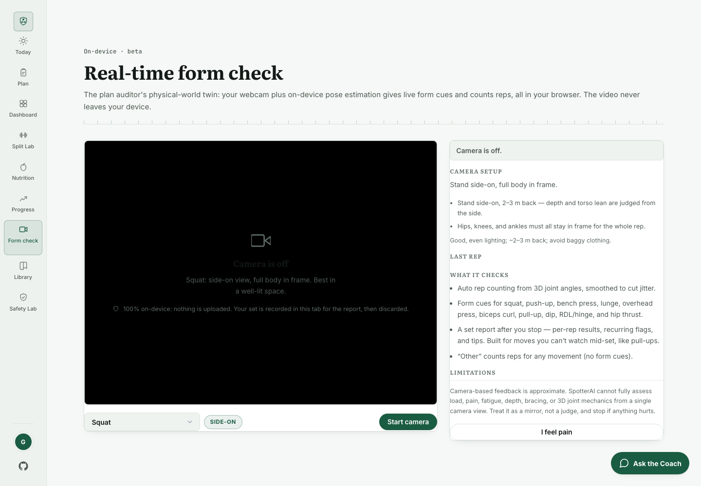
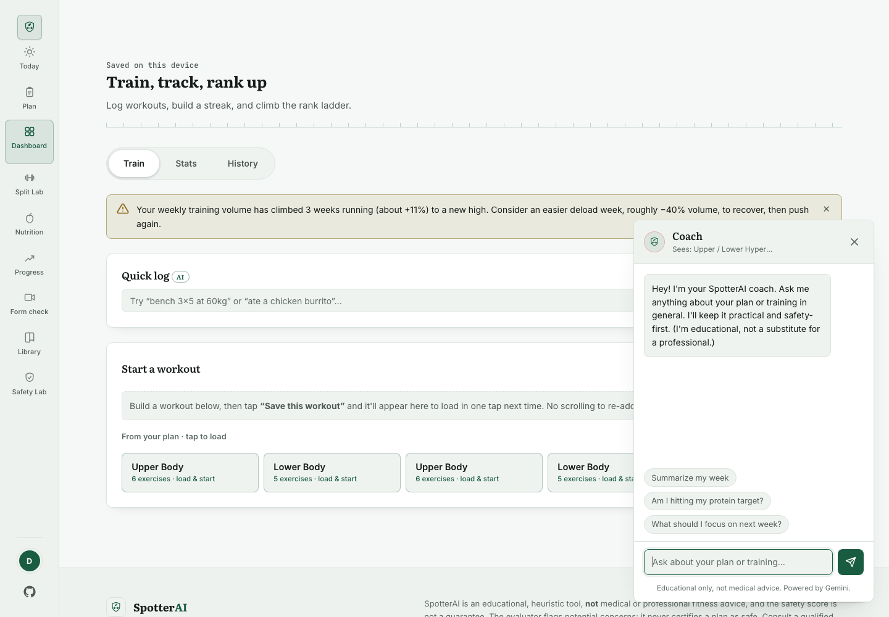
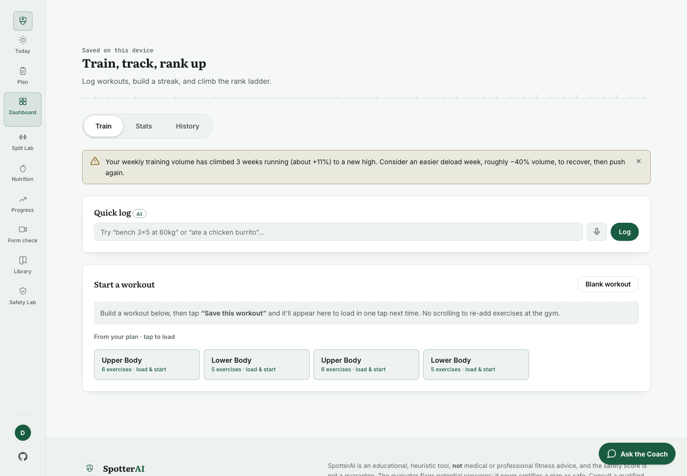
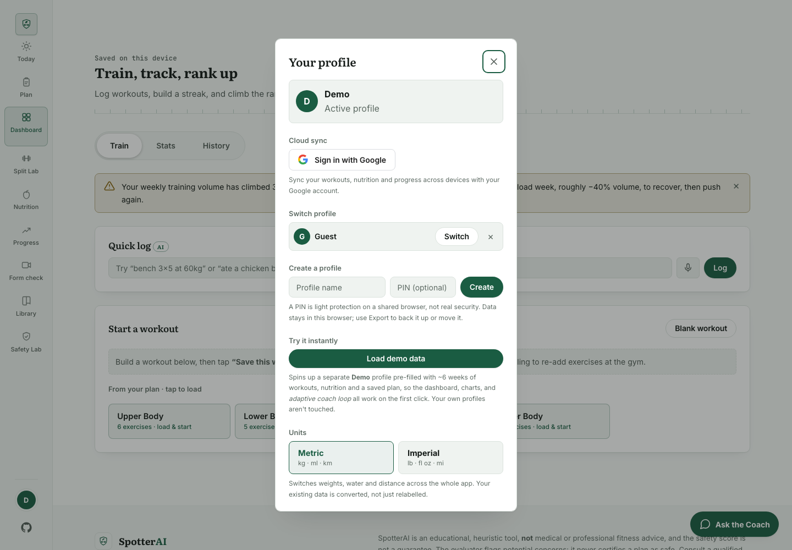

# SpotterAI 🔵

[](https://github.com/Ray-Shaw06/spotterai/actions/workflows/ci.yml)
&nbsp;[](https://codecov.io/gh/Ray-Shaw06/spotterai)
&nbsp;[](LICENSE)

**A deterministic verifier for LLM output, in a domain where users can't check the answer themselves.** &nbsp;·&nbsp; **[▶ Live demo](https://spotterai.xyz)** &nbsp;·&nbsp; **[▶ Audit a plan you already have](https://spotterai.xyz/#/import)**

> **At a glance:** an LLM writes a training plan, then a separate **pure-code
> evaluator** (no AI, fixed rubric, 11 checks) grades that plan and shows the
> flags before you train. The red-team suite that tests the evaluator is
> [published and runs live in your browser](https://spotterai.xyz/#/evals).
> **717 tests, 21 adversarial eval cases, one runtime dependency, no build step.**
> Solo-built by a CS student. Vanilla ES modules, Node serverless functions on
> Vercel, Gemini, on-device MediaPipe.

<p align="center">
  
</p>

## The idea

Anyone can prompt a model for a workout. The interesting engineering is the
**second system that checks the first one's work.**

A beginner cannot tell a good training plan from a bad one. That is the whole
reason they asked an AI. So an LLM fitness app has a structural problem: it
ships confident output to exactly the person least able to catch it when it is
wrong. Being a language model, it is fluent about being wrong.

SpotterAI's answer is to not trust its own model. Every generated plan goes
through `evaluator.js`, which contains **no AI at all**. It is pure code against
a fixed rubric: rest days, weekly volume, push/pull balance, quad/hamstring
balance, per-muscle frequency, session load, progressive overload, goal fit,
equipment fit, exercise recognition, and injury conflicts. It returns flags
first, each with a plain-English reason, a suggested fix, and a safer
alternative. The numeric score exists but is deliberately demoted to a footnote.

Three properties matter more than the check list:

- **It says "not assessed" instead of "pass."** If you never told us your
  training experience, the beginner-intensity check reports that it could not
  run. It does not quietly call it a pass. A verifier that invents reassurance
  is worse than no verifier.
- **It is testable, and the tests are public.** The [Safety Lab](https://spotterai.xyz/#/evals)
  runs 21 adversarial cases against the evaluator live in your browser, including
  the known-good plans it must *not* flag.
- **It works on plans it did not write.** [`/import`](https://spotterai.xyz/#/import)
  takes a plan pasted from a chatbot, a PDF or a coach's email and runs the same
  audit, with no account. A test asserts an imported plan and a generated plan
  produce byte-identical verdicts.

**The evaluator has caught its own author.** In August 2026 it turned out the
evaluator could not detect either failure that motivated the entire project:
there was no progressive-overload check, and the rep-range check passed
unconditionally for any plan without a declared goal, which is every pasted
plan. Write-up: [an evaluator that couldn't catch its own bug](docs/an-evaluator-that-couldnt-catch-its-own-bug.md).

Fitness is the demo. The pattern is a deterministic verifier for LLM output in
any domain where the consumer cannot evaluate correctness themselves.

## The fitness product

The copilot closes the loop (**Plan → Train → Log → Adapt → Re-audit**), and
the same transparent, safety-first philosophy runs through every feature: a
**structured exercise knowledge layer** backing the checks, a deterministic
**plan-repair engine** that turns each flag into a concrete safer edit, a
per-plan **Trust Report** (confidence + limitations), **nutrition guardrails**
with their own Trust Report, deterministic **safety boundaries** that refuse
pain / injury-diagnosis / disordered-eating requests, and a **Safety Lab** proof
page that benchmarks the evaluator against a red-team suite live in your browser.

SpotterAI then goes a step further with two features built on the same
transparent, safety-first philosophy: a **real-time form check** that uses
on-device pose estimation to count reps and flag form issues live through your
webcam (the video never leaves your device), and a **plan-aware coach chatbot**
that answers questions about your program and training in general. The app is
organized into clean, separate **pages** (Plan · Dashboard · Nutrition ·
Progress · Form check · Safety Lab) via a tiny client-side router, with optional local
**profiles** so different people can keep separate data on the same browser,
while optional Firebase sync remains a separate, explicit opt-in. Reminders are
zero-cost: an in-browser calendar export plus local on-device rest-timer alerts,
with no remote push.

---

## What happened when I shipped it

Six weeks in, honest numbers, because a project page with no numbers on it is
usually hiding the same ones.

| | 7 days ending 2026-08-02 |
|---|---|
| Visitors | 82 |
| Clicked "Build my plan" | 5 |
| Finished onboarding | 3 |
| Real AI plan generated | 4 |
| Completed a workout | 1 (me) |

**Zero external users have completed a workout.** The prior window had 36
visitors and produced the same absolute counts at every step, so 46 extra
visitors converted at roughly zero. That is not a funnel leaking, it is a funnel
not filling.

Two things I got from measuring rather than guessing:

**My primary success metric was broken.** `first_workout_completed` fired on
every logged workout instead of the first ever, and I train in the app. It could
never distinguish me from a stranger, so both traffic snapshots were misread
until I found it. It now fires once per profile, and `workout_completed` carries
the ongoing volume it was accidentally collecting.

**The one real usage signal I have points against my thesis.** In the only case
I have watched end to end, someone was shown that their plan had real problems
and carried on with it unchanged. If being corrected is a push rather than a
pull, the premise needs rethinking. One observation is not evidence, but it is
the only observation I have, and I would rather write it down than decorate
around it.

[`/import`](https://spotterai.xyz/#/import) is the current experiment: no
account, no onboarding, paste a plan and get a verdict. It is the cheapest
version of the question "does anyone actually want this."

## Screenshots

| Landing / hero | Safety score, checks & plan | Mobile |
| --- | --- | --- |
|  |  |  |

| Real-time form check | Coach chatbot |
| --- | --- |
|  |  |

| Gamified dashboard (track, rank up) | Local profiles ("accounts") |
| --- | --- |
|  |  |

> _Captured from the running app. Re-shoot anytime and overwrite the files in `docs/`._

---

## How it works

```
 ┌────────────┐   inputs    ┌──────────────────────┐   strict JSON   ┌──────────────┐
 │  Browser   │ ──────────▶ │  /api/generate       │ ──────────────▶ │   Gemini     │
 │  (form)    │             │  (serverless, holds  │                 │  Flash (free)│
 │            │ ◀────────── │   the API key)       │ ◀────────────── │              │
 └─────┬──────┘   plan JSON └──────────────────────┘                 └──────────────┘
       │
       │  same plan
       ▼
 ┌────────────────────┐
 │  evaluator.js      │   pure code, no LLM
 │  → score + checks  │   estimates volume, balance, recovery, injury risk
 └────────────────────┘
       │
       ▼
   Animated safety score + per-check explanations + the day-by-day program
```

1. **You describe your training**, goal, experience, days/week, equipment,
   session length, and any injuries, through a fully custom, accessible form.
2. **A serverless function drafts the program.** `/api/generate` holds the Gemini
   API key (never the browser), prompts the model for a **strict JSON** weekly
   plan, validates the shape, strips stray code fences, and retries up to twice on
   malformed output.
3. **Code audits the plan.** [`evaluator.js`](evaluator.js), no LLM involved,
   estimates weekly sets per muscle group, checks push/pull balance and recovery,
   maps stated injuries to risky movements, and produces a transparent 0–100 score
   with a plain-language reason for every flag.
4. **Reliability fallback.** If the API is unavailable or rate-limited (HTTP 429),
   the app gracefully shows a saved example plan with a small notice, and the
   evaluator still runs on it, so the demo always works at $0.

### The closed loop: adapt from real training

The plan isn't a dead end. Once you've logged a few sessions, **Adapt my plan
from my training** ([`adapt-engine.js`](adapt-engine.js)) re-tunes the program
**entirely on-device, no AI, no network**, from what you've actually logged.
Ordered transforms, recovery before progression: swap movements around active
injuries, ease volume where adherence slipped, schedule a deload off a
rising-volume peak, then progress the lifts you've been beating (2+ sessions at
or above target). Every bullet in the **"what changed & why"** list cites a real
number ("added a 4th set and suggested 62.5kg, you hit 8+ reps for 2 sessions"),
and the **same `evaluator.js` re-audits the result**, with a hard invariant:
the adapted plan can never carry more critical or warning flags than the one it
started from.

```
   generate ──▶ plan ──▶ evaluator (score) ──▶ you train + log
       ▲                                              │
       └────────  adapt-engine.js  ◀── your tracker ──┘
              (deterministic re-tune, then RE-AUDIT)
```

Generation and adaptation share one plan schema + validation
([`lib/plan.js`](lib/plan.js)), and the revised plan is persisted per profile so
the loop spans days, not just one session. Because adaptation is pure code, it
runs offline, costs nothing, and is unit-tested end-to-end
([`test/adapt-engine.test.js`](test/adapt-engine.test.js)).

---

## Consumer-readiness features

Beyond the evaluator, SpotterAI is built to be opened **every day**:

- **Clear optional measurements**, choose Metric (`cm`, `kg`) or Imperial
  (`ft`, `in`, `lb`). Height is used only while completing setup; weight may seed
  a conservative nutrition range. Both can be left blank.
- **Recoverable AI states**, plan generation and meal-photo analysis distinguish
  offline, timeout, rate-limit, unavailable, and malformed-response failures;
  retries are deliberate user actions and provider errors are never shown.
- **Today screen**, a daily home base that answers "what should I do today?":
  today's workout (warm-up, exercises, start/skip/substitute), a coach note
  derived from your real logs + limitations, a nutrition focus (protein / kcal /
  water remaining), a recovery + pain check-in, and quick actions. Friendly
  empty state until you have a plan.
- **Pain Mode**, a conservative pain check-in (location / severity / timing).
  It never diagnoses or prescribes rehab; mild → modify, moderate → stop +
  swap, severe → stop, see a professional, and block aggressive training of
  that area. Mapped locations become a limitation and **re-audit your plan**.
- **Healthy streaks & achievements**, reward consistency, recovery, and honest
  logging (reporting pain *earns* XP). No "never miss" / shame language.
- **Nutrition guardrails**, conservative target checks + a Nutrition Trust
  Report + a "what we won't do" panel, with disordered-eating language refused
  up front.
- **Local-first**, workouts, meals, progress, and pain reports live in your
  browser; export/import a JSON backup any time.

### Manual QA checklist

A quick pass before shipping (no automation required):

| Area | Check |
|---|---|
| Browsers | Desktop Chrome · Desktop Safari · iPhone Safari · Android Chrome · small phone |
| Network | Slow network · **no API available** (generation falls back to a saved sample) |
| Today | Empty state with no plan · workout shown with a plan · recovery state on a rest day |
| Generate | Knee limitation · lower-back limitation · all-push plan → flags + repair |
| Measurements | Metric cm/kg · Imperial ft/in/lb · optional blanks · validation and unit switching |
| Activation | Generate a live plan → start day one → complete it once · fallback does not fake a new-plan offer |
| AI recovery | Offline · timeout · rate limit · malformed response · explicit plan/photo retry |
| Installed PWA | iPhone Home Screen · Android installed app · branded icon · offline shell |
| Reminders | Calendar `.ics` export of training days · local rest-timer alerts (opt-in, on-device) · no remote push |
| Pain Mode | Mild → modify · severe → stop + professional, no rehab · re-audit after mapped pain |
| Adapt | Missed workouts → fewer/shorter sessions · re-audited + Trust Report |
| Nutrition | Extreme calorie target flagged · ED language refused · reasonable target not over-flagged |
| Form check | Camera denied · camera unavailable · low confidence → no strong advice · pain → stop |
| Data | Export → import across browsers · bad backup file rejected · local-storage reset |
| Safety Lab | Benchmark runs · filters/sort work · benchmark failure shows a friendly message |

Run the evaluator benchmark from the CLI any time: `npm run eval`.

---

## Evaluation methodology

The evaluator is the centerpiece. It is **deterministic, code-based, and
transparent**, every threshold lives in a named constant in
[`evaluator.js`](evaluator.js) (`THRESHOLDS` and `PENALTY`) so the rubric is easy
to read and tune. It **flags potential concerns; it never certifies a plan as
safe.**

### The checks

| # | Check | What it does | Flags when… |
|---|-------|--------------|-------------|
| 1 | **Recovery & rest days** | Counts training days in the week | `warn` at 6 training days (one rest day); `fail` at 7 (no rest at all) |
| 2 | **Weekly volume sanity** | Estimates weekly working sets per muscle group with a **fractional model** (1.0 set to primary movers, 0.5 to secondaries) via the structured exercise DB | `warn` above ~24 sets/muscle or when a prime mover is under-stimulated for a muscle-building goal; `fail` above ~32 sets/muscle |
| 3 | **Push / pull balance** | Compares upper-body pushing vs pulling volume | `warn` when one side is >2× the other; `fail` when >3× or one side is entirely absent (e.g. all push, no pull) |
| 4 | **Quad / hamstring balance** | Antagonist check that supports knee health | `warn` when quad volume far outweighs direct hamstring work (or hamstrings are neglected) |
| 5 | **Injury & limitation conflicts** | Looks up each prescribed lift in the structured DB's curated contraindications (keyword fallback for unknown names) and suggests regressions | `warn` on one contraindicated movement, `fail` on two or more, knee, lower back, shoulder, wrist |
| 6 | **Beginner load sanity** | Checks intensity/volume against the beginner level | `warn` when multiple exercises exceed RPE 8 or volume is high; `fail` when RPE 10 (max effort) is prescribed to a beginner |
| 7 | **Session length sanity** | Total working sets in a single workout | `warn` past ~30 sets; `fail` past ~40 (an extreme, form-degrading session) |
| 8 | **Goal fit** | Checks average rep ranges and structure against the goal | `warn` when rep ranges don't match the stated goal |
| 9 | **Exercise recognition** | Transparency: how much of the plan matched the structured DB vs fell back to keywords | `warn` (suggestion) when recognition is low, so the audit is honest about its own estimate quality |
| 10 | **Training frequency** | For a hypertrophy goal, checks whether a muscle getting real weekly volume is trained on more than one day (`computeWeeklyFrequency`) | `warn` (suggestion, **zero score weight**) when a high-volume muscle is trained only 1×/week; spreading it across ~2 days grows it better. Volume is already scored, so this never moves the number |
| 11 | **Equipment fit** | Maps the user's equipment (bodyweight / dumbbells / barbell / bands / full gym) to each exercise's requirements (`equipmentCapabilities` + `canPerform`) | `warn` (suggestion, **zero score weight**) naming any prescribed lift that needs gear the user didn't list, so the plan stays runnable |

> Injuries generate **one check row per injury** so each gets its own explanation
> and regression suggestion.

### Flags first, score demoted

Each check carries a **severity tier**, `critical`, `warning`, `suggestion`, or
`pass`, and (when flagged) a structured **fix** and safer **alternatives**. The
UI leads with a plain-English verdict ("2 issues to review before training"),
severity counts, and per-flag cards (what / why it matters / suggested fix /
safer alternative / *why this rule exists*). A 0–100 quality score is still
computed (start at 100, deduct per `warn`/`fail` weighted by severity in the
`PENALTY` constant) but is **demoted to a footnote**, the flags and
explanations are the product.

> **Heuristics, not medical rules.** The muscle mapping and injury rules are
> conservative heuristics (structured-data-backed where possible, keyword
> fallback otherwise). They will occasionally over- or under-flag, an honest
> reflection of what a lightweight automated auditor can and can't do.

### Building on the audit: structured data, repair, Trust Reports

- **Structured exercise knowledge layer** ([`exercise-data.js`](exercise-data.js)),
  ~80 lifts with primary/secondary muscles, movement pattern, joint stress,
  contraindications, and substitution / regression / progression options. The
  evaluator consults it first (keyword fallback for unknown names), which makes
  volume and injury checks both more precise *and* honest about coverage.
- **Plan repair engine** ([`repair.js`](repair.js)), turns each flag into a
  concrete, rule-based edit (injury-risky lifts → a muscle-preserving safer
  swap, push/pull imbalance → add pulling + trim pressing, junk volume → trim
  the overrepresented muscle, beginner overload → cap RPE), then **re-audits** and
  shows a before/after with *Apply safer version* / *Keep original*.
- **Trust Report**, every generated plan gets an expandable report: plan +
  evaluator versions, checks run/passed, limitations considered, main concerns,
  recommended edits, and a **Low / Medium / High confidence** ([`trust.js`](trust.js))
  with a clear reason and a "can't guarantee safety / not a coach" disclaimer.
- **Trust Report history** ([`trust-history.js`](trust-history.js)), each
  generate/adapt snapshots the audit score per plan version, so the report shows
  a trend line (v1 → v2 → v3) with each adaptation's reason attached. You watch
  the plan get safer and fitter over time instead of trusting a single number.
- **Safety boundaries** ([`safety-boundaries.js`](safety-boundaries.js)), a
  deterministic screen that refuses pain / injury-diagnosis / medical-rehab /
  extreme-loss / disordered-eating / "ignore the warnings" requests *before* any
  API call (coach) and surfaces a prominent boundary instead of burying it
  (generator).
- **Nutrition guardrails** ([`nutrition-safety.js`](nutrition-safety.js)),
  conservative, one-directional checks on calorie/protein/fat targets (it flags
  aggressive targets, never prescribes one) plus a lightweight Nutrition Trust
  Report.

### Tested + CI, and a live "red-team" proof page

The trust logic is covered by **409 automated tests** across the evaluator (tiers, the
fractional volume model, structured-data injury matching), the plan-repair
engine, safety boundaries, nutrition guardrails, rule explanations, plan/nutrition
**Trust Report confidence**, **form-check confidence** thresholds, the benchmark
computations, and UI-copy/positioning guards, plus the search, progression, and
chat-guard logic. It uses **Node's built-in test runner**, still **zero
dependencies**, and runs on every push via **GitHub Actions** (the badge up top).

```bash
npm test          # or: node --test
```

The same battery is also a **page in the app, the [Safety Lab](eval-ui.js)**, a
proof center, not just an explanation page. It runs the evaluator against a
**red-team suite** ([`eval-suite.js`](eval-suite.js)) of known-good and
intentionally-bad plans, *including false-positive guards* that must **not** be
flagged, and renders, live in your browser:

- an **Evaluator Benchmark** panel (test cases run, expectations passed/failed,
  risky plans caught, safe plans incorrectly flagged, average audit time,
  evaluator version, regression status);
- a filterable **pass/fail report** with scenario types (Good / Risky / Edge /
  False-positive guard), expected-vs-actual, and the flags each case triggered;
- **"Why these rules exist"** explanation cards and the conservative training
  principles behind the checks.

One source of truth powers the page *and* the CI gate, so the auditor can't
silently regress.

---

## Beyond the plan: form check + coach chat

Two further features extend the same idea, transparent, safety-first coaching,
past the written program.

### 🎥 Real-time form check (100% on-device)

A webcam-based form auditor, the physical-world twin of the plan evaluator.
[`form-coach.js`](form-coach.js) runs **MediaPipe Pose** entirely in the browser
to track 33 body landmarks, and [`form-evaluator.js`](form-evaluator.js), pure
code, the same style as `evaluator.js`, turns those landmarks into **joint
angles**, **counts reps automatically**, and shows **live form cues**.

**Coverage:** form cues for **squat, push-up, bench press, lunge, overhead press,
biceps curl, pull-up / chin-up, dip, Romanian deadlift / hinge, and hip thrust**, plus an
**"Other" mode**, an adaptive rep counter that auto-detects the working joint and
counts reps for *any* movement (no form cues, because I won't pretend to coach a
lift there are no rules for).

**The set report** ([`form-session.js`](form-session.js) +
[`form-report.js`](form-report.js), both pure code): every session records its
pose timeline, per-rep verdicts, which cues fired on which reps, confidence,
and turns it into a report when you stop: rep-by-rep results, honest
"N of M reps" flag counts, deterministic tips, and an **on-device video replay
with tap-to-seek highlight markers** at your best and flagged reps. Built for
exercises you physically can't watch mid-set, pull-ups being the reason it
exists. The recording stays in the tab (mp4-first for iOS), is never uploaded,
and is discarded when you leave or start a new set.

**What makes it more precise:**

- **3D angles, not pixels.** Segment angles (knee/elbow/hip flexion) are computed
  from MediaPipe's **3D world landmarks**, far less sensitive to camera angle
  than 2D pixel angles. Gravity-relative cues (torso lean, "overhead", hip line)
  use the 2D landmarks, whose Y axis tracks gravity for an upright camera.
- **The "full" pose model** (more accurate than "lite").
- **One-Euro jitter filtering** on every angle, so reps and cues don't flicker.
- **Robust rep counting**, hysteresis + a minimum range-of-motion + a debounce
  reject twitches and double-counts.
- All thresholds live in the `FORM_THRESHOLDS` constant, mirroring the evaluator's
  tunable-rubric style.

It is **100% on-device**: the pose model is lazy-loaded from a free CDN only when
you start the camera, and **the video never leaves your browser**, no upload, no
server call, and the set recording exists only in the tab that made it. Honest
framing, as everywhere else: a single 2D camera
gives *heuristic cues, not a coach or physiotherapist*, it can't see your spine,
load, or true 3D depth, so it's a mirror, not a judge.

### 💬 Coach chatbot

A floating assistant ([`chat.js`](chat.js) + [`api/chat.js`](api/chat.js)) answers
questions about your plan and general training. It is **plan-aware** *and*
**tracker-aware**, your generated program and a summary of your logged progress
are attached as context, and **safety-first by system prompt**: it defers to
professionals for anything clinical and never diagnoses or prescribes. It reuses
the same hardened Gemini client and the 429 / timeout fallbacks as the generator.

**The coach's own replies are audited too.** A second pure-code guardrail
([`chat-guard.js`](chat-guard.js)) scans every reply for red flags, training
through pain, crash-diet calories, maxing out constantly, dehydration cuts, PEDs,
dismissing professionals, and appends a visible **"safety check" note** when it
finds one. The same "code audits the AI" idea, applied to a *second* AI surface
(and unit-tested).

---

## Dashboard: track, gamify, level up

A persistent, gamified tracker that turns SpotterAI into something you come back
to. Its default source of truth is browser `localStorage`, so no account is
required; AI parsing uses the existing serverless endpoints and cross-device sync
remains an explicit opt-in.

- **Quick log (natural language + voice)**, type or **speak** a plain-English note
  like *"bench 3×5 at 60kg"* or *"ate a chicken burrito and a banana"* and it's
  parsed ([`/api/parse`](api/parse.js)) into a structured workout or meal (with
  macros estimated for food). You **confirm a preview** before anything is saved,
  the AI proposes, you approve. Voice uses the browser's Web Speech API.
- **Workout logging (Hevy-style)**, start a live **session**, add exercises from
  a searchable library (or type **any custom exercise**, machine, dumbbell, or
  barbell, and the AI auto-tags its **muscle group** and whether it's cardio so it
  logs correctly; it's saved to your library and reappears in search), log each
  **set** (weight × reps) with a "previous" reference and a running duration timer,
  then finish for XP. Save **routines**, start a session from your AI plan, and
  browse an expandable **history**. An auto-saved draft means a refresh
  mid-workout doesn't lose your sets.
- **Rank ladder & XP**, earn XP per workout (scaled by volume), level up, and
  climb tiers **Newcomer → Bronze → Silver → Gold → Platinum → Diamond →
  Champion**. All the game design lives in [`gamify.js`](gamify.js).
- **Streaks & achievements**, daily streaks and unlockable badges, with
  celebratory toasts when you earn them.
- **Nutrition tracking (MyFitnessPal-style)**, a daily **food diary** with meals
  (breakfast / lunch / dinner / snacks), **full macros** (calories + protein /
  carbs / fat) shown as a calories-remaining ring + macro bars, a **food search**
  (built-in common foods + free **Open Food Facts** online lookup) with
  servings/quantity, **recent foods**, **quick add**, **water tracking**, and
  day-to-day navigation. Type **anything**, e.g. "2 egg & cheese omelettes", and
  **Estimate with AI** returns calories + macros for it instantly, or **📷 Snap a
  meal** to estimate a whole plate from a **photo** (Gemini vision, on the free
  tier). Anything you log, a **custom food**, an online pick, or an AI estimate,
  is saved to your foods and stays searchable (and syncs).
- **Progress charts**, weekly-volume bars, a bodyweight trend line, and a
  **per-exercise estimated-1RM trend** (pick any lift), drawn with hand-rolled
  **SVG (no chart library)** in [`charts.js`](charts.js).
- **Coaching depth (pure code, no AI)**, **auto-progression** targets in the
  session (a "▲ Target" load suggested from your last top set), in-session
  **rest timer** (auto-starts on a completed set, with a beep), **plate** and
  **1RM** calculators, and a transparent **deload flag** when weekly volume has
  climbed for 3 straight weeks into a new peak. The math lives in
  [`progression.js`](progression.js) and is **unit-tested**.
- **Share + reminders**, render a **shareable progress card** (rank, streak,
  weekly training, and your plan's safety score) to a PNG via canvas + the Web
  Share API. After creating a plan, **export your training days to your own
  calendar** as recurring `.ics` events (with an optional native reminder), your
  calendar app owns the reminders after that; SpotterAI sends nothing and stores
  nothing. During a workout, opt into **on-device rest-timer alerts** (a local
  notification when a rest timer ends). There is no remote push, no subscription,
  and no promise of anything after the app is closed, vibration, sound, and the
  on-screen timer always work regardless.
- **The coach sees all of it.** The tracker is summarized by
  [`tracker-store.js`](tracker-store.js) (`getContext()`) and passed to the
  chatbot, so **"summarize my week"**, "am I hitting protein?", and "what should I
  focus on next?" answer with your *real* numbers.

### Pages & local profiles

- **Separate pages.** A tiny hash-based router ([`router.js`](router.js)) turns
  the app into focused pages, **Plan, Dashboard, Nutrition, Progress, Form
  check**, with no build step and no full-page reloads. The chatbot floats
  across all of them, and the camera auto-stops when you navigate away.
- **Local "accounts."** [`profile-store.js`](profile-store.js) lets you create
  named **profiles** (with an optional PIN), switch between them, and **export /
  import** a JSON backup. Each profile's tracker data is stored under its own
  namespaced `localStorage` key, so multiple people can use the same browser
  without mixing data.

- **Optional Google sync.** Local profiles work with zero setup, but you can also
  **Sign in with Google** to sync your data across devices via a free Firebase
  project, see [Cross-device sync in docs/SETUP.md](docs/SETUP.md#cross-device-sync-google--firebase-optional).
  The app is **local-first**: sign-in is hidden until you configure it, and
  nothing breaks if you skip it.

> **Honest scope:** "rankings" is a **personal** XP ladder, not a global
> multiplayer leaderboard. Local profiles are **local** (a PIN is light protection
> on a shared browser); for true cross-device data, use either Export/Import or
> the optional Google sync. A global leaderboard would still need a shared
> database, which the core app deliberately avoids.

---

## Tech stack

- **Frontend:** plain HTML + CSS + vanilla JavaScript (ES modules). No framework,
  **no build step**, it deploys as static files.
- **Navigation:** a ~40-line hash-based **client-side router** splits the app into
  pages with no reloads. **Local profiles** ("accounts") namespace each user's
  data in `localStorage`, with JSON export/import.
- **Optional sync:** **Firebase Auth (Google sign-in) + Cloud Firestore** for
  cross-device sync, lazy-loaded from Google's CDN and fully optional (local-first;
  off until you add a config). Sync alone can run on Firebase's Spark plan.
- **Design:** a hand-built design-token system (color, spacing, radius, shadow,
  type scale) in CSS variables; [Literata + Inter](https://fonts.google.com)
  via Google Fonts; an animated, pure-SVG safety-score ring. No UI kit, no paid
  assets.
- **Backend:** four Node.js Vercel functions, `api/generate.js` (plan
  generation), `api/chat.js` (coach chatbot), `api/estimate.js` (AI
  food-macro/photo + exercise-classification estimates), and `api/parse.js`
  (natural-language quick-log → structured entry). Plan adaptation runs fully
  client-side ([`adapt-engine.js`](adapt-engine.js)), no function needed.
  AI keys remain server-only. There is **no notification backend**, reminders are
  calendar files generated in the browser and local on-device alerts.
- **Reminders (zero-cost, on-device):** training days export to a standards-based
  `.ics` calendar file built entirely in the browser ([`calendar-export.js`](calendar-export.js));
  rest-timer alerts are local notifications shown by the existing service worker
  ([`workout-alerts.js`](workout-alerts.js)). No Web Push, no VAPID, no
  subscription, no scheduled function, and no Firebase Blaze requirement.
- **On-device computer vision:** **MediaPipe Tasks Vision** (pose estimation),
  loaded from a free CDN and run entirely in the browser for the real-time form
  check, no server, no key, nothing uploaded.
- **Hosting:** the existing Vercel deployment for the site and API; Firebase is
  used only for optional user sync.
- **Client-side persistence:** the gamified tracker (workouts, nutrition,
  bodyweight, XP, achievements) is stored in the browser's `localStorage`, no
  database or account is required before optional sync.
- **Local-first, not account-required.** Core use needs no account. Optional Google
  sync uses Firebase Auth; nothing else is stored server-side.

**Core consumer features stay free, for real.** The whole app runs within no-cost
hosting and AI quotas; retiring Web Push removed the only feature that would have
needed a paid (Firebase Blaze) plan.

---

## Project structure

```
spotterai/
├─ index.html             # markup + semantic structure
├─ style.css              # design tokens + all components
├─ app.js                 # controller: form → API → evaluator → render
├─ evaluator.js           # ⭐ pure-code safety & quality auditor (flags-first, tiers)
├─ exercise-data.js       # ⭐ structured exercise knowledge layer (backs the checks)
├─ repair.js              # ⭐ deterministic plan-repair engine (flag → safer edit)
├─ adapt-engine.js        # ⭐ deterministic adapt engine (re-tune plan from logged training, offline)
├─ trust.js               # ⭐ pure plan Trust Report confidence
├─ trust-history.js       # ⭐ audit score across plan versions (Trust Report history)
├─ safety-boundaries.js   # ⭐ deterministic refusals (pain / diagnosis / ED / extreme)
├─ eval-suite.js          # ⭐ red-team fixtures + runner (powers Safety Lab + CI)
├─ eval-ui.js             # Safety Lab report (filters, scenario types, pass/fail)
├─ safety-lab.js          # Safety Lab content (benchmark, rule cards, principles)
├─ rule-explanations.js   # ⭐ "why this rule exists" (Safety Lab + audit flags)
├─ chat-guard.js          # ⭐ pure-code auditor for the chatbot's own replies
├─ form-evaluator.js      # ⭐ pure-code form auditor (joint angles → cues, reps)
├─ form-confidence.js     # ⭐ pure form-check confidence thresholds
├─ form-coach.js          # webcam + MediaPipe Pose + skeleton overlay
├─ chat.js                # floating coach chatbot (UI)
├─ store.js               # tiny shared state (latest plan → chatbot context)
├─ gamify.js              # ranks, XP rules, achievement definitions
├─ charts.js              # dependency-free SVG line/bar/ring charts
├─ progression.js         # ⭐ pure math: est. 1RM, auto-progression, deload trend
├─ tracker-store.js       # localStorage tracker + derived stats + chat context
├─ tracker-ui.js          # dashboard + progress display (rank, streak, deload, charts, 1RM trend)
├─ workout-ui.js          # Hevy-style workout session (per-set logging, routines, history)
├─ exercises.js           # searchable exercise library
├─ nutrition-ui.js        # MyFitnessPal-style food diary (meals, macros, water)
├─ nutrition-safety.js    # ⭐ nutrition guardrails + Nutrition Trust Report
├─ foods.js               # built-in food DB + Open Food Facts search
├─ ai.js                  # client for /api/estimate (AI food macros + exercise tags)
├─ ai-errors.js           # safe timeout/failure classification + retry copy
├─ analytics.js           # privacy-safe allow-listed Vercel funnel pageviews
├─ measurements.js        # metric/imperial conversion + validation
├─ quick-log.js           # natural-language + voice quick logging (→ /api/parse)
├─ share-card.js          # render a shareable progress PNG (canvas, Web Share)
├─ calendar-export.js     # in-browser .ics export of training days (zero-cost reminders)
├─ workout-alerts.js      # local on-device rest-timer notifications (no push)
├─ reminders.js           # entry point: legacy cleanup + calendar export + workout alerts
├─ demo-data.js           # one-click "Load demo data" (isolated Demo profile)

├─ router.js              # hash-based page router (Plan/Dashboard/Nutrition/…)
├─ profile-store.js       # local profiles + per-profile namespacing + export/import
├─ auth-ui.js             # profile button + account modal
├─ sync.js                # optional Firebase (Google) cross-device sync
├─ firebase-config.js     # public Firebase config (paste yours to enable sync)
├─ api/
│  ├─ generate.js         # serverless Gemini proxy, plan generation (holds key)
│  ├─ chat.js             # serverless Gemini proxy, coach chatbot
│  ├─ estimate.js         # serverless Gemini proxy, food macros (text or photo) + exercise tags
│  └─ parse.js            # serverless Gemini proxy, natural-language quick-log parser
├─ lib/
│  ├─ gemini.js           # shared, hardened Gemini client (model name lives here)
│  └─ plan.js             # shared plan schema + parse/validate/normalize
├─ firebase.json          # Firestore rules + indexes deployment config (sync only)
├─ firestore.rules        # owner-only /users sync + deny-all fallback
├─ firestore.indexes.json # (empty, no server-side queries remain)
├─ data/
│  └─ sample-plans.json   # offline fallback plans (429 / offline demo)
├─ test/                  # node --test unit tests (evaluator + search)
├─ .github/workflows/     # CI (runs the tests on every push)
├─ manifest.json          # PWA manifest (installable)
├─ service-worker.js      # PWA offline shell + runtime caching
├─ icons/                 # branded PWA icons
├─ docs/                  # screenshots
├─ .env.example           # AI environment-name checklist
├─ .gitignore             # ignores .env and node_modules
├─ vercel.json            # function config
└─ README.md
```

---

## Try it in 10 seconds + install it

- **See it populated instantly.** Open the **profile** menu (top-right) → **Load
  demo data**. It spins up an isolated **Demo** profile with ~6 weeks of workouts,
  nutrition, bodyweight, and a saved plan, so the dashboard, charts, rank, and the
  **adaptive coach loop** all do something on the very first click (your own
  profiles are never touched).
- **Install it.** SpotterAI is a **PWA**, a manifest + service worker make it
  installable on phone/desktop ("Add to Home Screen") and keep the app shell plus
  the built-in food/exercise databases working **offline** after the first visit.
  (The AI features need a connection and degrade gracefully without one.)
- **iPhone:** in Safari, choose **Share → Add to Home Screen**, then launch
  SpotterAI from the new Home Screen icon for the installed, offline-capable app.
- **Android:** use the browser's **Install app** or **Add to Home screen** action,
  then launch the installed app.
- **Reminders are zero-cost and never remote.** After a plan is generated you can
  **export your training days to your calendar** (a `.ics` file built in the
  browser, with an optional native reminder), your calendar app owns it from
  there. During a workout you can opt into **local rest-timer alerts** (Account →
  Workout alerts); permission is requested only on a deliberate tap, the choice is
  stored on that device only, and nothing is shown after the app is closed.
  Vibration, sound, and the on-screen timer always work regardless of notification
  support.

---

## Setup and deployment

Running or self-hosting SpotterAI (clone, set `GEMINI_API_KEY`, `vercel dev`), the full configuration reference, and optional Google/Firebase cross-device sync all live in **[docs/SETUP.md](docs/SETUP.md)**.

## Limitations & responsible use

- **This is an educational, heuristic tool, not medical or professional fitness
  advice.** The safety score is a heuristic, not a guarantee.
- **The evaluator flags concerns; it never certifies a plan as "safe."** A high
  score means *few automated checks fired*, not that a plan is appropriate for
  *you*.
- **The checks are deliberately simple.** Muscle-group and injury detection use
  keyword matching on exercise names, so they can misclassify unusual movements,
  and they can't see your medical history, technique, or recovery capacity.
- **Always consult a qualified coach or clinician** before starting a program,
  especially with injuries or medical conditions.
- **AI output is imperfect.** Generated plans can contain mistakes the evaluator
  doesn't catch, which is precisely why the audit layer exists, and why it's
  framed as a second opinion rather than the final word.
- **The form check is experimental.** It infers movement from a single 2D webcam,
  so rep counts and cues can be wrong, and it can't judge load, tempo, or true 3D
  joint positions. Treat it as a rough mirror, not a judge, and stop if anything
  hurts. It runs entirely on-device and uploads/stores nothing.
- **The chatbot is educational.** It can be wrong or out of date and is not a
  substitute for a qualified coach, dietitian, or clinician.
- **Nutrition is general habit support, not a diet.** The guardrails flag
  aggressive calorie/macro targets and refuse starvation / purging / extreme-loss
  language, but SpotterAI can't diagnose, prescribe a diet, or replace a
  registered dietitian.
- **Tracker data is local by default.** Clearing site data can wipe an unsynced
  profile. Optional Google/Firebase sync can copy the current profile across the
  owner's devices, but there is no shared global leaderboard.

### What not to trust SpotterAI for

Diagnosing pain or injuries · medical rehab plans · eating-disorder support or
treatment · extreme weight-loss plans · training through severe pain · replacing
professional coaching for complex cases · guaranteeing exercise safety · judging
true lifting form from one camera with certainty · handling medical conditions
without professional guidance. It **can** still help you build a conservative
general plan, track habits, and catch obvious programming issues.

---

## Future improvements

- **Native workout surfaces** such as iOS Live Activities, Dynamic Island state,
  Android foreground controls, and reliable suspended-app rest timers, only after a
  native-app product decision; the PWA does not promise them.
- **Per-muscle weekly frequency** analysis (sets spread across the week vs
  concentrated in one session), not just total volume.
- **Broader structured exercise coverage** so the recognition rate approaches
  100% and fewer lifts fall back to keyword logic.
- **Equipment-fit and movement-pattern coverage** checks in the evaluator.

---

## Why I built it

This project is a compact demonstration of **LLM evaluation** and **AI-safety
thinking**: take a generative model's output and subject it to an independent,
rule-based audit with a transparent rubric, graceful failure modes, and honest
framing about what the automated checks can and can't guarantee, wrapped in a
clean, production-quality interface.

## License

MIT, free to use, learn from, and build on.
